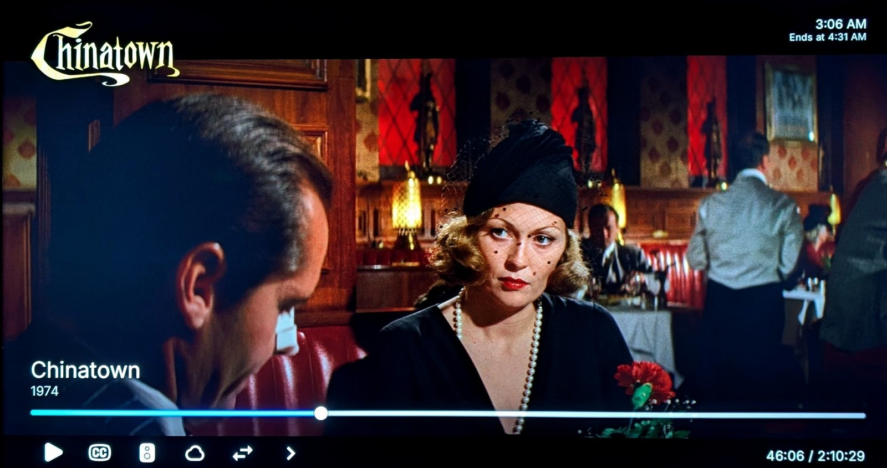

# Nuvio C

A personal build of [Nuvio TV](https://github.com/NuvioMedia/NuvioTV) for Android TV. It is the official app with a few small changes, and installs alongside it.

**Download:** [latest Nuvio C release](https://github.com/savantguarded/NuvioTV/releases/latest)

## What's new or different

**Player**
- The title's logo shows top-left on the player controls, inside a fixed box so wide and square logos look balanced and are never cropped. It appears a few seconds after playback starts so it doesn't clash with the parental guide, HDR/Dolby Vision popups or the stats screen.
- Small badges bottom-right, beside the title, all the same outlined tile on one line: resolution (`4K`), picture (`DV`, `HDR10`, `HDR10+`, `HLG`), audio (`ATMOS 7.1`, `DTS-HD MA 5.1`, `DD+ 5.1`…) and source (`REMUX`, `WEB-DL`…), then the file size in plain text. The picture format is what the TV is actually being sent, read from the decoded video when the file or stream name doesn't say (e.g. `2160p.WEB.h265` releases that are really HDR). HDR10+ is found in the video stream itself (the first couple of hundred frames are checked), so HDR10+ files whose name doesn't mention it still say HDR10+ (ExoPlayer, MKV / MP4 files).
- Official button row with the time on the right. The focused button's name shows small underneath it, with the current subtitle or audio track (e.g. "Subtitles · English SDH"). **Switch player engine** lives in the More row (the hidden buttons) with its own icon.
- Skip Intro and the next-episode card sit just above the seek bar while the controls are open, so they never overlap it or get cut off.
- Faster controls: no full-screen layer for the HDR dim, no re-layout when the seek bar gets focus, and the clock, time, seek bar, logo and title block each redraw on their own, so a tick of one doesn't redraw the whole OSD. In HDR the subtitle dim only uses a layer on subtitle frames that have something in them.
- Bottom subtitles move up while the controls are open, so they never sit behind the title, seek bar or buttons, then drop back when the controls close. Subtitles at the top of the screen stay where they are. Your subtitle settings are not changed.
- Close a panel (subtitles, audio, sources, episodes, speed…) and focus lands back on the button that opened it, not on Play/Pause.
- Year shown for movies only, not series. Titles opened from Continue Watching get their year back.
- Thinner, brighter seek bar (YouTube style) and a taller bottom shadow. The "via" source line is hidden.
- **Start over** button right after Play/Pause: jumps back to 0:00 (and plays if paused).
- Controls stay up 8 seconds after you open them (official: 3), but still hide 3 seconds after a seek.
- In HDR, HLG and Dolby Vision, subtitles and everything the player draws over the video (controls, logo, badges, panels, pause screen, popups) are shown at 60% brightness so they don't glare. The controls stay solid (darker, not see-through). It kicks in whenever any HDR is detected, the same rule as the picture badge. The picture itself is untouched. (On the mpv player only plain-text subtitles are dimmed.)
- The loading screen shows the add-on and debrid service (e.g. "Torrentio · TorBox") and the release filename at the bottom.
- If a source turns out to be a short placeholder clip (e.g. "not cached" or "service unavailable" videos) instead of the real video, it is paused, a message says so and the Sources panel opens to pick another.
- The next episode starts straight away, whether you press Next episode or it plays automatically (no 3-second countdown).
- After you press Skip Intro (or it times out), the remote keeps working straight away: focus goes back to the player instead of getting lost.
- **Prefer SDH Subtitles** (Settings > Playback > Subtitles, off by default): when the player picks a subtitle in your language, an embedded SDH track wins over the plain one. Add-on subtitles and forced subtitles work as before.
- **Subtitle font**: the app fonts for subtitles too, in the player's subtitle style list ("Font") and Settings > Playback > Subtitles (a pick-one list like Appearance > Font, each name shown in its own font). Plain-text subtitles only; ASS and picture subtitles keep their own look.



**Details page**
- **Rate** button (star) next to Watched: a "Your Rating" dialog, pick 1 to 10 (starts on 5), with "Sync to Trakt" / "Sync to MDBList" switches (only the ones you're signed in to). It overwrites your rating there, and Remove rating clears it. Your Trakt ratings are read too (a tiny check at most every 15 minutes, the full list only when it changed), so titles rated anywhere on Trakt show the white star and open on your score.
- No empty gap under the synopsis when an add-on's description ends in blank lines.
- Creator and Cast / Ratings / More like this are pills, the same as the season tabs.
- The MDBList ratings line under the title keeps its space while it loads, so the title block doesn't shift a moment after the page opens.
- The Shuffle button is the same size as Play.

**Trailers**
- Background trailers ("Play in Background") play muted, with a **Play Trailer Muted** setting under Settings > Layout > Details to play them with sound (faded in). The trailer button carries on with the same playback and fades the sound in.
- The countdown runs wherever you are on the page, once per visit. Titles you've started or watched don't start a background trailer.
- Lighter dimming over a background trailer; the title logo fades in.
- Popups, comments, the full synopsis, cast and production pages and other titles pause the background trailer; it carries on from the same spot when you come back. Before the trailer has started, they stop the countdown and it starts again from the beginning when you come back. One press of Back stops it and leaves the page.
- The trailer screen (trailer button, trailers row) uses the same seek bar as the player.
- While a trailer plays with sound, a small title logo shows bottom-left, just above the seek bar.
- When YouTube rate-limits, or a title's YouTube trailer is under 720p, the IMDb trailer is used instead (720p or better).
- **Prefer IMDb Trailers** (Settings > Layout > Details, off by default): IMDb first for every trailer, YouTube only when IMDb has nothing in HD. IMDb trailers take a few seconds longer to start.

**Cast pages**
- Filmography lists real work only: no talk shows, award shows, news, reality or "Self" / archive-footage appearances. Actor pages never fill up with producer credits.
- Director, writer and creator pages list only what they created, directed or wrote (no executive producer or "thanks" credits).
- Under each title: the character played, or the job ("Creator · Director · Writer"). Long lines take turns scrolling when the poster is focused.
- Back on a filmography row jumps to the first title, like the home rows. On the first title, Back leaves the page as usual.

**Appearance**
- 7 extra app fonts in Settings > Appearance > Font, picked to look clearly different: Geist, Google Sans Flex, Outfit, Space Grotesk, Lexend, Atkinson Hyperlegible Next and Source Serif 4 (all SIL Open Font License, see `docs/nuvio-c-fonts-OFL.txt`). The chosen font also reaches the player's Episodes and Sources panels and the few other screens official leaves on the system font.
- A small clock top-right on Home and inside collection folders, formatted like the player clock (e.g. 4:14 AM) on a see-through rounded square.
- Cleaner profile screen: no "Who's watching?", hint, star, "Primary" label or supporter badge beside the Nuvio logo; "Add Profile" is a button under the profiles.

**Accounts**
- Simkl logs in with its newer device login (QR code on the TV) and renews itself, so you stay signed in.

## Switching a tweak off

Every tweak has its own switch. Switched off, that part of the app behaves exactly like official Nuvio.

1. On GitHub: **Settings > Secrets and variables > Actions > Variables**, add or edit `NUVIO_C_OFF`.
2. Put the switch names in it, separated by commas, e.g. `osd_badges,subtitle_lift`.
3. **Actions > Nuvio C build > Run workflow**, tick "Build even if this official release was already built". To try a switch for one build only, type the names in the "off" box there instead.

The release notes list what was switched off. Clear the variable to turn everything back on.

| Switch | What it turns off |
|---|---|
| `osd_logo` | Title logo top-left on the player controls |
| `osd_badges` | Resolution / picture / audio / size badges |
| `subtitle_lift` | Bottom subtitles moving up while the controls are open |
| `focus_return` | Focus going back to the button that opened a panel |
| `seek_bar_style` | YouTube-style seek bar and taller bottom shadow |
| `series_no_year` | Hiding the year for series |
| `hide_via` | Hiding the "via" source line |
| `year_backfill` | Year for titles opened from Continue Watching |
| `simkl_v2` | Simkl's newer device login (back to the PIN login) |
| `background_trailers` | Nuvio C behaviour for official's "Play in Background" trailers |
| `bg_trailer_sound_toggle` | The "Play Trailer Muted" setting (background trailers always muted) |
| `bg_trailer_back_exits` | One-press Back out of a playing background trailer (back to two presses) |
| `bg_trailer_skip_watched` | No background trailer for started or watched titles |
| `trailer_screen_bar` | Player-style seek bar on the trailer screen |
| `trailer_screen_logo` | Small logo on the trailer screen |
| `imdb_trailer_backup` | IMDb trailers when YouTube rate-limits |
| `hdr_dim` | 60% subtitles and controls during HDR / Dolby Vision |
| `loading_filename` | Add-on / provider line and filename on the loading screen |
| `placeholder_check` | Pausing short placeholder clips and opening Sources |
| `next_ep_no_countdown` | Skipping the next-episode countdown (Next press and auto-play) |
| `osd_timeout` | 8-second controls (back to 3 seconds) |
| `start_over` | The Start over button |
| `cast_acting_only` | Real filmography and role lines on cast pages |
| `cast_back_to_first` | Back jumping to the first title on a cast page's filmography row |
| `skip_intro_focus` | Focus going back to the player after Skip Intro |
| `shuffle_button_size` | Play-sized Shuffle button |
| `trailer_max_1080p` | 1080p trailer cap (**off**: trailers as official) |
| `profile_minimal` | Netflix-style profile screen (**off**: official profile screen) |
| `hdr_decoded` | HDR read from the decoded video and HDR10+ from the video stream (back to file info and stream name only) |
| `hero_ratings_space` | Reserved space for the MDBList ratings line while it loads |
| `skip_above_seek` | Skip Intro / next-episode card placed just above the seek bar (back to official fixed spot) |
| `osd_split` | Split button row with the time under the seek bar (**off**: official row) |
| `engine_in_more` | Switch player engine in the More row (back to the main row) |
| `osd_focus_label` | Focused button name under it |
| `extra_fonts` | The 7 extra fonts (back to the official three) |
| `subtitle_font` | The subtitle font picker (back to the default subtitle font) |
| `prefer_sdh` | The Prefer SDH Subtitles setting |
| `detail_tabs_pills` | Pill-style Cast / Ratings / More like this tabs |
| `detail_rating` | The Rate button |
| `profile_clean` | Clean profile screen (back to the official one) |
| `browse_clock` | Clock on Home and in collection folders |
| `font_everywhere` | App font in the player's Episodes / Sources panels and other Material 3 text (back to the system font there) |

The switches live in `app/src/main/java/com/nuvio/tv/NuvioCFeatures.kt`. Ones marked **off** are set to `false` there; change the line back to `true` to bring them back. To remove a tweak's code for good rather than switch it off, its commits can be reverted; each tweak is in its own commits (listed in the project notes).

## How it's kept up to date

A build runs automatically every hour. When Nuvio publishes a new release, the same changes are applied on top and a new Nuvio C APK is posted to Releases. If an official update clashes with the trailer tweaks, the IMDb backup, or the cast filmography, the APK is still built, just without that feature.

Everything else works like the official app.

---

*The official Nuvio TV readme follows.*

<div align="center">

  

  <p>
    A free, open-source media app for your phone, your desktop, and the TV you already own.
    <br />
    Bring your own sources. Nuvio turns them into a library with artwork, ratings, subtitles, and your place saved on every screen.
  </p>

  [Website](https://nuvio.tv) · [GitHub releases](https://github.com/NuvioMedia/NuvioTV/releases/latest) · [Support Nuvio](https://nuvio.tv/support)

</div>

## Get Nuvio TV

- [Android TV on Google Play](https://play.google.com/store/apps/details?id=com.nuvio.app)
- [Android TV APK](https://github.com/NuvioMedia/NuvioTV/releases/latest)

## Build from source

```bash
git clone https://github.com/NuvioMedia/NuvioTV.git
cd NuvioTV
./gradlew :app:assembleFullDebug
```

Nuvio TV is built with Kotlin, Jetpack Compose, TV Material 3, and Media3. Development requires Android Studio, a JDK, and the Android SDK.

## License

[GNU General Public License v3.0](./LICENSE)
